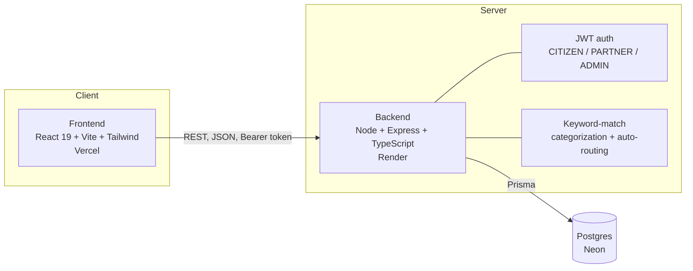

# Civic Challenge Platform (SIH26043)

Citizens submit civic challenges (education, agriculture, healthcare, water,
environment, energy, urban development, public admin). The platform
auto-categorizes each submission by keyword match and auto-routes it to the
university/industry partner covering that domain. Partners work the
challenge through to completion; admins get a read-only dashboard of
totals, domain/status breakdowns, and engagement.

## Live

| | |
|---|---|
| Frontend | https://project-dt-2026-frontend.vercel.app/ |
| Backend health check | https://projectdt2026.onrender.com/api/v1/health |

## Demo accounts

All passwords: `Demo@1234`

| Role | Login | Notes |
|---|---|---|
| Citizen | `citizen@demo.local` | Submits challenges |
| Admin | `admin@demo.local` | Read-only dashboard |
| Partner | `partner1@demo.local` | Jharkhand State University — Education, Public Admin |
| Partner | `partner2@demo.local` | AgriTech Industries Ltd — Agriculture, Environment |
| Partner | `partner3@demo.local` | Ranchi Institute of Health Sciences — Healthcare, Water |
| Partner | `partner4@demo.local` | Urban Energy Solutions — Energy, Urban Development |

## Architecture



Citizen submits a challenge → backend keyword-matches it to a category →
auto-routes it to the partner covering that domain → partner moves it
`ASSIGNED → IN_PROGRESS → COMPLETED` → both sides get notifications on
assignment and status changes → admin dashboard reads aggregate counts.

Full API contract and schema: [`PROJECT_REFERENCE.md`](./PROJECT_REFERENCE.md).
Build history and current status: [`PROJECT_STATUS.md`](./PROJECT_STATUS.md).

## Tech stack

- **Frontend:** React 19, Vite, TypeScript, Tailwind, React Router, TanStack Query, React Hook Form, Zod
- **Backend:** Node, Express, TypeScript, Prisma, Zod, JWT (`jsonwebtoken`), `bcryptjs`
- **Database:** PostgreSQL (Neon)
- **Deploy:** Vercel (frontend), Render (backend)
- **Monorepo:** pnpm workspaces (`apps/frontend`, `apps/backend`)

## Local development

```bash
pnpm install

# apps/backend/.env
DATABASE_URL=   # your Neon connection string
JWT_SECRET=     # any random string
PORT=4000

pnpm --filter backend prisma:generate
pnpm --filter backend prisma:migrate
pnpm --filter backend seed        # creates the demo accounts above

pnpm dev:backend    # http://localhost:4000
pnpm dev:frontend   # http://localhost:5173
```

## Repo structure

```
apps/
  backend/    Express API, Prisma schema + seed, JWT auth
  frontend/   React SPA (citizen / partner / admin views)
```
